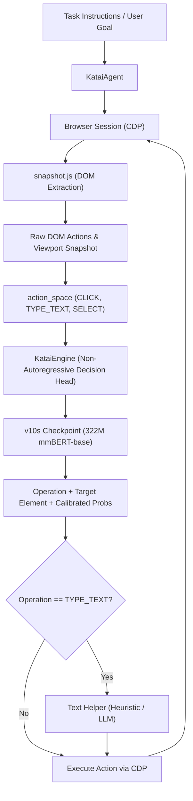

<div align="center">
  
  <h1>Katai</h1>
  <p><em>pronounced "ka-tai" or "cat-ai!"</em></p>
</div>


**Katai** is a high-speed, non-autoregressive browser automation agent & workshop. It operates with language models with a specialized, single-forward-pass decision engine based on fine-tuned [Laya](https://github.com/NandhaKishorM/laya) models.


https://github.com/user-attachments/assets/676d17b0-dd04-4491-ba99-85ce6858fbd3


While conventional web agents suffer from high latency (3–8 seconds per step) and token costs when prompting generative LLMs with raw HTML or accessibility trees, Katai formulates browser interaction as typed decision-making over candidate action spaces. Using a 322M parameter multimodal BERT backbone (`v10s`), Katai predicts the next browser operation and target element in **17–23 ms on CUDA** and **300–500 ms on Apple Silicon MPS**, outputting calibrated probability distributions over all observed interactive controls.

> [!NOTE]
> **Katai** currently only supports Laya and its specialized fine-tuned forks. With time, support for additional open-weight foundation models will be introduced.

---

## Key Capabilities

- **Sub-Second System-1 Decision Head**:
  Non-autoregressive decision model trained via Reinforcement Learning with Calibrated Decisions (RLCD) on real browser execution trajectories and Mind2Web.
- **Coarse-to-Fine Candidate Selection**:
  Interleaved tournament algorithm partitions wide DOM candidate pools (>12 elements) across parallel chunk evaluations, computing joint probabilities across hundreds of elements within sequence budget.
- **Hardware Acceleration**:
  Native, automatic acceleration across Apple Silicon Metal (`mps`), NVIDIA GPU (`cuda`), and CPU.
- **Autonomous Browser Engine**:
  Direct Chrome DevTools Protocol (CDP) WebSocket communication, atomic DOM extraction via `snapshot.js`, automated Chrome process management, and unmutating loop detection.
- **Text-Input LLM Routing & Hybrid Form Input (100% Offline Capable)**:
  Seamlessly connects to OpenAI, OpenRouter, DeepSeek, Ollama, or vLLM when configured. Smart regex and quotation parser extracts search queries, emails, and input parameters directly from user instructions without requiring external API keys incase of LLM absence.
- **Web Console**:
  Embedded dark-mode console built with React, Vite, Tailwind CSS, Lucide icons, and Shadcn UI components. Features live Chrome viewport streaming, real-time SVG element bounding-box overlays, interactive DOM candidate exploration, step-by-step control (Predict / Act), calibrated confidence gauges, and execution trace history.
- **Visual Terminal Interface & Progress Tracking**:
  Branded ASCII banner initialization, clean unicode progress bars, calibrated confidence meters, and tree-structured step execution summaries. Includes fast-path local HuggingFace cache detection and isolated progress reporting without line collisions.
- **TypeSafe Drop-in Server**:
  Provides a standalone HTTP server implementing the `/v1/systemone` specification, compatible with existing `jev-ultrafast` workflows.

---

## Architecture



### Execution Pipeline

1. **Observation**: `snapshot.js` is evaluated in the browser context to inspect visible, uninhibited controls (buttons, links, textboxes, comboboxes, checkboxes, dropdowns, and scroll containers), assigning deterministic indices and capturing viewport coordinates (`rect`).
2. **Action Space Partitioning**: Elements are grouped into operation targets (`CLICK`, `TYPE_TEXT`, `SELECT`) and page-level controls (`SCROLL_DOWN`, `SCROLL_UP`, `WAIT`).
3. **Format v3 Packing & Chunk Tournament**: Candidate controls are rendered directly into question criteria rather than dumping raw page markup into the context window. If candidates exceed `KATAI_MAX_OPTIONS`, an interleaved chunk tournament runs in parallel, calculating `P(candidate) = P_final(chunk winner) × P_chunk(candidate)`.
4. **Action Execution & Guardrails**: The selected action is executed via CDP. If the operation is `TYPE_TEXT`, the input value is supplied by the hybrid text helper. Changes in DOM fingerprint and URL are verified to detect stale pages and prevent infinite interaction loops.

### Package Structure

```text
katai/
├── core/               # Engine, agent orchestrator, browser CDP, snapshot DOM reader
│   ├── agent.py        # High-level KataiAgent lifecycle & loop detection
│   ├── browser.py      # Chrome CDP WebSocket connection & process management
│   ├── engine.py       # Non-autoregressive decision model & chunk tournament
│   ├── snapshot.js     # Atomic DOM state and action extraction script
│   └── text_helper.py  # Hybrid offline heuristic and LLM form text completion
├── cli/                # Command-line interface
│   ├── ascii.txt       # Branded ASCII art banner
│   └── main.py         # Subcommands: run, console, server, verify, chrome
├── web/                # Interactive web console
│   ├── console.py      # Embedded dashboard server with live screenshot streaming
│   └── static/         # Pre-built production SPA assets (Shadcn + Vite)
└── server/             # Standalone TypeSafe SystemOne API
    └── systemone.py    # Standalone HTTP server for /v1/systemone
frontend/               # React + Vite + Tailwind + Shadcn UI source
branding/               # Official icons and art assets
tests/                  # Full unit and integration test suite
```

---

## Installation

### Prerequisites
- Python 3.10 or higher
- Google Chrome or Chromium installed on the host system
- [uv](https://github.com/astral-sh/uv) (recommended) or standard `pip`
- Node.js 18+ (only if modifying and building `frontend/` source)

### Setup

Clone the repository and install dependencies in editable mode:

```bash
# Clone the repository
git clone https://github.com/Shiawaseu/katai.git
cd katai

# Create virtual environment and install dependencies using uv
uv venv
source .venv/bin/activate
uv pip install -e .

# Or using standard python venv
python3 -m venv .venv
source .venv/bin/activate
pip install -e .
```

---

## Verification

To verify that the model checkpoint loads onto your hardware acceleration backend (MPS / CUDA / CPU) and matches expected predictions:

```bash
katai verify
# or: python3 -m katai verify
```

Expected diagnostic output:
```text
=================================================================
  KATAI DECISION ENGINE DIAGNOSTICS
=================================================================
[KataiEngine] Loading v10s on mps...
[KataiEngine] Loaded in 19014.0ms | fmt=v3 | head_max_len=768
  [1/2] Warming up decision model:    [████████████████] 100% (1349.5 ms)
  [2/2] Evaluating Mind2Web sample:   [████████████████] 100% (1225.7 ms)
-----------------------------------------------------------------
  Model:       laya-v10s
  Device:      MPS
  Latency:     1225.7 ms (single forward pass)
  Tokens:      6,918
  Operation:   TYPE_TEXT (confidence: [█████████░] 92%)
  Target:      [2] [2] Search Wikipedia (searchbox)
  Expected:    TYPE_TEXT -> MATCH [OK]
=================================================================
```

---

## Usage & Commands

The CLI can be invoked directly as `katai`, via `python3 -m katai`, or using python script entry points.

```text
usage: katai [-h] {run,server,console,verify,chrome} ...
```

### 1. Autonomous Task Execution (`katai run`)

Executes an autonomous browsing session from start to finish with live visual progress bars, decision confidence indicators, and action trees:

```bash
katai run <url> <goal> [options]
```

**Options:**
- `--checkpoint <name>`: Model checkpoint (`v10s`, `v10`, `v11s`, `typed-decisions`, or local path; default: `v10s`)
- `--device <dev>`: Acceleration device (`mps`, `cuda`, `cpu`; default: auto-detected)
- `--headless`: Run Chrome in background headless mode
- `--max-steps <int>`: Maximum step budget before terminating (default: `60`)

**Example:**
```bash
katai run \
  "https://en.wikipedia.org/wiki/Main_Page" \
  "Search Wikipedia for 'Python programming language' and open the article."
```

**Output format:**
```text
=================================================================
  KATAI AUTONOMOUS BROWSER AGENT
=================================================================
  Target URL:   https://en.wikipedia.org/wiki/Main_Page
  Goal:         Search Wikipedia for 'Python programming language' and open the article.
  Model:        v10s
  Headless:     False
  Max Steps:    60
=================================================================

[1/3] Initializing Decision Engine (v10s)...
[KataiEngine] Loading v10s on mps...
[KataiEngine] Loaded in 18900.2ms | fmt=v3 | head_max_len=768
[2/3] Connecting to Chrome via DevTools Protocol (CDP)...
      CDP Connected (MPS) [OK]
[3/3] Observing initial page viewport & DOM action space... [48 controls detected]
      Initial Title: Wikipedia, the free encyclopedia
-----------------------------------------------------------------

Step 01/60 [░░░░░░░░░░░░░░░░░░░░]   2%
  ├─ Operation:  TYPE_TEXT  (conf: [█████████░] 92%) · 310ms
  ├─ Target:     [2] [2] Search Wikipedia (searchbox)
  ├─ Typed text: "Python programming language"
  └─ Status:     [READY] · DOM Mutated

Step 02/60 [█░░░░░░░░░░░░░░░░░░░]   3%
  ├─ Operation:  CLICK      (conf: [██████████] 97%) · 280ms
  ├─ Target:     [3] [3] Search (button)
  └─ Status:     [READY] · DOM Mutated
...
=================================================================
  SESSION RESULT: DONE
  Completed in 4 steps (3420 ms / 3.42s total)
  Final URL:   https://en.wikipedia.org/wiki/Python_(programming_language)
  Final Title: Python (programming language) - Wikipedia
=================================================================
```

---

### 2. Web Console (`katai console`)

Starts the local web console with interactive control, real-time live browser viewport streaming, SVG bounding box overlays, candidate exploration, and probability inspection:

```bash
katai console [options]
```

**Options:**
- `--port <int>`: Port to bind console server to (default: `8766`)
- `--host <str>`: Host interface to bind server to (default: `127.0.0.1`)
- `--checkpoint <name>`: Model checkpoint (default: `v10s`)
- `--device <dev>`: Acceleration device (`mps`, `cuda`, `cpu`)
- `--headless`: Run Chrome in background headless mode

Open `http://127.0.0.1:8766` in your browser.

#### Console Features:
- **Live Viewport Streaming**: View live Chrome rendering with reactive element hover effects and synchronized SVG bounding boxes.
- **Action Space Candidate Table**: Search, filter by operation/role (`button`, `link`, `textbox`), and view viewport coordinates (`rect`).
- **Granular Execution Controls**:
  - **Step**: Predict and act in a single step.
  - **Predict Only**: Inspect model decision and target distribution without modifying page state.
  - **Act**: Apply the pending predicted action.
  - **Auto-Run / Pause**: Stream continuous execution.
  - **Reset**: Close session and reset browser state.
- **Keyboard Shortcuts**:
  | Key | Action |
  |---|---|
  | `Space` | Execute single Step |
  | `R` | Toggle Auto-Run / Pause |
  | `Esc` | Stop current execution |
  | `?` | Toggle Shortcuts Modal |

#### Frontend Development & Rebuilding:
Production static assets are pre-built inside `katai/web/static/`. To modify the dashboard UI:
```bash
cd frontend
npm install
npm run build
```

---

### 3. Standalone SystemOne Server (`katai server`)

Starts an HTTP server implementing the TypeSafe `/v1/systemone` specification, compatible with `jev-ultrafast` workflows:

```bash
katai server [options]
```

**Options:**
- `--port <int>`: Server listening port (default: `8791`)
- `--host <str>`: Server listening host (default: `127.0.0.1`)
- `--checkpoint <name>`: Model checkpoint (default: `v10s`)
- `--device <dev>`: Acceleration device (`mps`, `cuda`, `cpu`)

Endpoints:
- `GET /health`: Healthcheck endpoint returning status.
- `POST /v1/systemone`: Evaluates browser state and questions, returning operation and target predictions with input token usage.

---

### 4. Model Diagnostic Verification (`katai verify`)

Executes diagnostic warm-up and evaluation runs on pre-recorded benchmark trajectories:

```bash
katai verify [options]
```

**Options:**
- `--checkpoint <name>`: Model checkpoint (default: `v10s`)
- `--device <dev>`: Acceleration device (`mps`, `cuda`, `cpu`)

---

### 5. Chrome Remote Debugging Helper (`katai chrome`)

Launches an isolated Google Chrome instance with Chrome DevTools Protocol (CDP) enabled on port 9222:

```bash
katai chrome [options]
```

**Options:**
- `--port <int>`: CDP debugging port (default: `9222`)
- `--headless`: Launch Chrome in headless mode

---

## Python API

### Autonomous Browser Agent

```python
from katai import KataiAgent

# Initialize agent with fine-tuned checkpoint
agent = KataiAgent(checkpoint="v10s", headless=False)

# Start task
agent.start(
    url="https://en.wikipedia.org/wiki/Main_Page",
    goal="Search Wikipedia for 'Python programming language' and open the article."
)

# Step-by-step control loop
while agent.state["status"] not in ("done", "blocked"):
    agent.step()
    last = agent.state["history"][-1]
    print(f"Step {last['step']:2d} | {last['operation']:9s} | {last['action']} ({last['latency_ms']} ms)")

print(f"Result: {agent.state['status'].upper()} in {agent.state['elapsed_ms']} ms")
agent.close()
```

### In-Process Decision Head (No Browser Required)

`KataiEngine` can evaluate arbitrary DOM states or choice problems without launching a browser:

```python
from katai import KataiEngine

engine = KataiEngine(checkpoint="v10s")

state = {
    "page": {
        "title": "Hacker News",
        "url": "https://news.ycombinator.com/",
        "text": "1. Show HN: Katai Decision Head\n2. Ask HN: Browser agent benchmarks?"
    },
    "recent_actions": []
}

questions = {
    "operation": {
        "type": "choice",
        "criteria": {
            "CLICK": "Click a link or button",
            "SCROLL_DOWN": "Scroll down for more items",
            "DONE": "Goal satisfied"
        },
        "instructions": {"goal": "Open the newest submissions page"}
    },
    "click_target": {
        "type": "choice",
        "criteria": {
            "1": "[1] Hacker News (link)",
            "2": "[2] new (link)",
            "3": "[3] past (link)"
        },
        "instructions": {"goal": "Open the newest submissions page"}
    }
}

result = engine.predict(state, questions)
print("Predicted Operation:", result["answers"]["operation"]["choice"])
print("Target Element:     ", result["answers"]["click_target"]["choice"])
print("Inference Latency:  ", result["latency_ms"], "ms")
```

---

## Configuration Reference

Configuration can be specified in `.env` or as environment variables:

| Variable | Default | Description |
|---|---|---|
| `KATAI_CHECKPOINT` | `v10s` | Checkpoint name (`v10s`, `v10`, `v11s`, `typed-decisions`, or local path) |
| `BU_CDP_URL` | `http://127.0.0.1:9222` | Chrome DevTools Protocol endpoint URL |
| `KATAI_SERVER_PORT` | `8791` | Port for the standalone SystemOne HTTP server |
| `KATAI_WEB_PORT` | `8766` | Port for the interactive Web Console |
| `MAX_STEPS` | `60` | Maximum steps per browsing session |
| `KATAI_MAX_OPTIONS` | `12` | Candidate chunk budget for coarse-to-fine tournaments |
| `KATAI_FMT` | `v3` | Prompt serialization format version (`v3` recommended) |
| `ESCALATE_TAU` | `0.0` | System-2 escalation threshold (0.0 disables escalation) |
| `TEXT_MODEL_BASE_URL` | `https://openrouter.ai/api/v1` | Base URL for optional LLM form completion |
| `TEXT_MODEL_API_KEY` | *(empty)* | API key for LLM form completion (uses heuristic if omitted) |
| `TEXT_MODEL` | `qwen/qwen-2.5-7b-instruct` | Model identifier for LLM form completion |

*(Note: Legacy `LAYA_*` environment variables remain supported as fallbacks).*

---

## Testing

Run the full pytest suite:

```bash
pytest tests/
```

All 16 unit and integration tests verify:
- **DOM Action Space & CDP**: Action space partitioning, coordinate extraction, and browser discovery (`tests/test_browser.py`)
- **Web Console & SPA Assets**: Web console HTML delivery, compiled assets, branding icon endpoint, and API controls (`tests/test_console.py`)
- **Decision Engine**: Candidate compaction, format v3 packing, chunk tournament, and prediction latency (`tests/test_engine.py`)
- **SystemOne Server**: Standalone `/health` and `/v1/systemone` endpoints (`tests/test_server.py`)
- **Text Extraction**: Regex, email, and quotation heuristic text extraction (`tests/test_text_helper.py`)

---

## Benchmark Comparison

Empirical performance metrics based on the held-out test suite from PR #143:

| Metric | Base Zero-Shot (`typed-decisions`) | Fine-Tuned `v10s` (322M) | Fine-Tuned `v10` (421M) |
|---|---|---|---|
| **Element Top-1 Accuracy** (held-out pages, ~45 cands) | 0.10 *(chance)* | **0.63** | **0.66** |
| **Operation Accuracy** (`CLICK`, `TYPE_TEXT`, `SELECT`, `DONE`) | 0.54 | **0.88** | **0.89** |
| **Real Browser Suite Pass Rate** (16 live tasks) | 0 % | **62 %** | 50 % |
| **Inference Latency** (NVIDIA RTX 4070 Ti) | 50–200 ms | **17–23 ms** | 41–50 ms |
| **Inference Latency** (Apple Silicon MPS) | ~1,500 ms | **~300–500 ms** | ~650 ms |

---

## Acknowledgements & Upstream Sources

Katai builds upon and integrates foundational work from the open-source community:

- **[Laya](https://github.com/NandhaKishorM/laya)** by [NandhaKishorM](https://github.com/NandhaKishorM): The non-autoregressive decision engine architecture, RLCD training methodology, and typed decision framework.
- **[Laya Pull Request #143](https://github.com/NandhaKishorM/laya/pull/143)** by [cklxx](https://github.com/cklxx): The worked fine-tuning pipeline, DOM state format v3 design, and pre-trained browser decision heads released on Hugging Face ([`cklxx/laya-browser`](https://huggingface.co/cklxx/laya-browser)).
- **[jev-ultrafast](https://github.com/browser-use/jev-ultrafast)** by [browser-use](https://github.com/browser-use): The ultrafast browser automation agent design, headless execution loop, and `/v1/systemone` communication protocol.
- **[browser-harness](https://github.com/browser-use/browser-harness)**: High-speed Chrome DevTools Protocol session and process management.
- **[Mind2Web](https://huggingface.co/datasets/osunlp/Mind2Web)** by [OSU NLP](https://github.com/osunlp): Web agent dataset utilized for element grounding and multi-step action trajectories.

---

## License

This project is licensed under the [MIT](/LICENSE.md) License.
